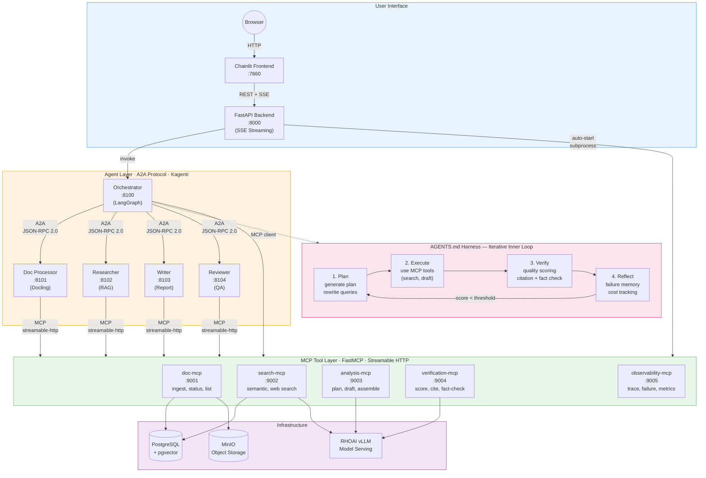
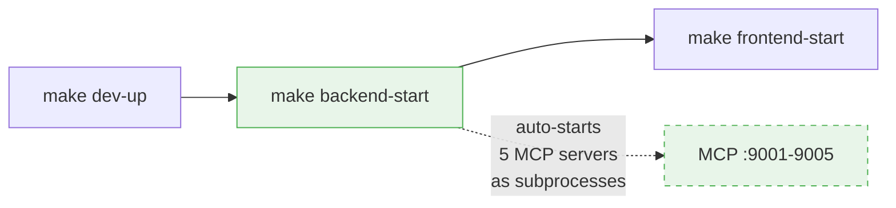

# RHOAI Custom Deep Research Lab

A hands-on lab for building **custom deep research systems** using **multi-agent harness engineering** on **Red Hat OpenShift AI (RHOAI)**. Upload documents, perform iterative deep research through collaborative AI agents with quality-driven feedback loops, and receive comprehensive analytical reports.

## Architecture



### Harness Inner Loop Detail

```
    ┌──────────┐     ┌──────────┐     ┌──────────┐
    │  1.Plan  │────▶│2.Execute │────▶│ 3.Verify │
    │ generate │     │ MCP tool │     │ quality  │
    │  plan    │     │ calls    │     │ scoring  │
    └──────────┘     └──────────┘     └─────┬────┘
         ▲                                  │
         │           ┌──────────┐           │
         └───────────│4.Reflect │◀──────────┘
        score <      │ failure  │
        threshold    │ memory   │
                     └──────────┘
    Iterations stop when score >= QUALITY_THRESHOLD or MAX_ITERATIONS reached.
```

## Key Technologies

| Component | Technology | Purpose |
|-----------|-----------|---------|
| Harness Engineering | AGENTS.md | Project-specific agent instructions, inner loop definition |
| Agent Control Plane | Kagenti | K8s-native agent lifecycle, identity, discovery |
| Agent Framework | LangGraph | Stateful graph-based agent logic |
| Inter-agent Protocol | A2A (Agent-to-Agent) | Standardized agent communication (JSON-RPC 2.0) |
| Tool Protocol | MCP (Model Context Protocol) | Standardized tool exposure via FastMCP + streamable-http |
| Document Intelligence | Docling | PDF/DOCX/PPTX parsing, table extraction, OCR |
| Vector Store | PostgreSQL + pgvector | Semantic search over document embeddings |
| Object Storage | MinIO | Document file storage |
| Model Serving | RHOAI vLLM | LLM and embedding inference |

## Lab Flow

| Phase | Folder | Focus | Key Outcome |
|-------|--------|-------|-------------|
| **0** | `0_setup/` | Environment & model setup | Cluster ready, model endpoints verified |
| **1** | `1_document_processing/` | Docling + pgvector | Documents parsed, chunked, embedded |
| **2** | `2_tool_layer/` | MCP tool servers | All MCP tools built and tested (doc, search, analysis, verification, observability) |
| **3** | `3_harness_engineering/` | AGENTS.md + inner loop | Iterative harness with quality-driven research |
| **4** | `4_agent_orchestration/` | Kagenti + A2A orchestration | Multi-agent pipeline with harness integration |
| **5** | `5_deployment/` | OpenShift deployment | Agents running on cluster via Kagenti |
| **6** | `6_evaluation/` | Quality & performance | Research quality metrics validated |

## Quick Start

1. Clone this repo:

```bash
git clone https://github.com/hyogrin/rhoai-custom-research-lab.git
cd rhoai-custom-research-lab
```

2. Configure environment:

```bash
cp sample.env .env
# Edit .env with your model endpoints (LLM_BASE_URL, EMBEDDING_BASE_URL)
# Models must be pre-deployed on RHOAI or any OpenAI-compatible endpoint
```

3. Install Python dependencies:

```bash
uv sync
```

4. Start local services:

```bash
make dev-up   # PostgreSQL+pgvector, MinIO
```

5. Follow phases 0–6 in order.

## Running the UI

The project includes a web UI (Chainlit frontend + FastAPI backend) for interactive document research with real-time progress streaming.



1. Start infrastructure (only once):

```bash
make dev-up          # PostgreSQL+pgvector, MinIO
```

2. Start the backend API (auto-starts all 5 MCP servers):

```bash
make backend-start   # FastAPI :8000 + MCP :9001-9005
```

3. Start the frontend (in a separate terminal):

```bash
make frontend-start  # Chainlit on port 7860
```

4. Open http://localhost:7860 in your browser.

The UI supports:
- **Document upload** — PDF and text files via drag-and-drop
- **Real-time progress** — SSE-streamed harness phases (Plan, Execute, Verify, Reflect) shown as collapsible steps with iteration counter and quality score
- **Session persistence** — Long-running research survives connection drops; resume from the last checkpoint via PostgreSQL-backed session state
- **Configurable harness** — Adjust quality threshold and max iterations from the settings panel

To stop everything:

```bash
make ui-stop         # Stops backend + frontend + MCP servers
```

> Set `USE_MCP=false` in `.env` to disable automatic MCP server startup (legacy direct-call mode).

## System Ports

| Service | Port | Protocol | Description |
|---------|------|----------|-------------|
| Chainlit Frontend | 7860 | HTTP | Web UI |
| FastAPI Backend | 8000 | HTTP + SSE | API server (auto-starts MCP subprocesses) |
| Orchestrator Agent | 8100 | A2A (JSON-RPC) | Harness inner loop coordinator |
| Doc Processor Agent | 8101 | A2A | Document ingestion via Docling |
| Researcher Agent | 8102 | A2A | RAG search + context synthesis |
| Writer Agent | 8103 | A2A | Report generation |
| Reviewer Agent | 8104 | A2A | Quality scoring + feedback |
| doc-mcp | 9001 | MCP (streamable-http) | Document ingest, status, listing |
| search-mcp | 9002 | MCP (streamable-http) | Semantic search, web search |
| analysis-mcp | 9003 | MCP (streamable-http) | Plan, draft sections, assemble report |
| verification-mcp | 9004 | MCP (streamable-http) | Quality score, citation/fact check |
| observability-mcp | 9005 | MCP (streamable-http) | Traces, failures, metrics |

## Prerequisites

| Component | Version | Purpose |
|-----------|---------|---------|
| Red Hat OpenShift | 4.17+ | Container platform |
| OpenShift AI (RHOAI) | 3.4+ | Model serving (vLLM) |
| Kagenti | v0.2+ | Agent control plane |
| Python | 3.11+ | Lab notebooks and agent code |
| uv | 0.4+ | Python package manager |
| Podman | 4+ | Container builds (optional) |

## References

- [AGENTS.md](https://github.com/agentsmd/agents.md) — Open format for AI agent instructions
- [Kagenti ADK](https://github.com/kagenti/adk) — Agent Development Kit
- [Kagenti Platform](https://github.com/kagenti/kagenti) — K8s control plane
- [Docling](https://github.com/docling-project/docling) — Document intelligence
- [A2A Protocol](https://google.github.io/A2A) — Agent-to-Agent standard
