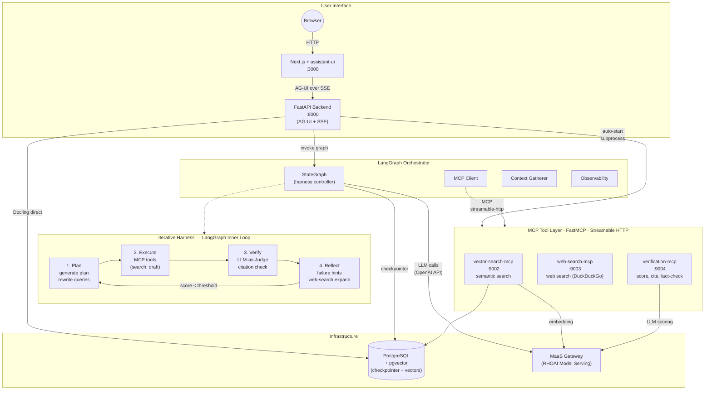
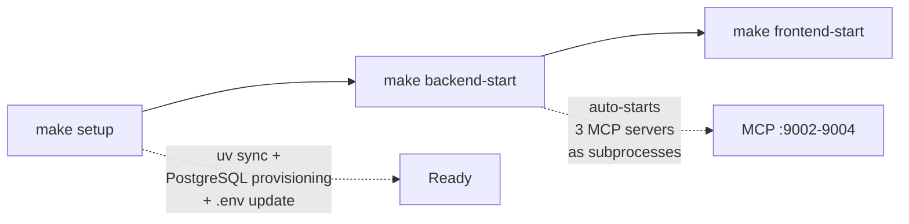

# RHOAI Custom Deep Research Lab

A hands-on lab for building **custom deep research systems** using **harness engineering** on **Red Hat OpenShift AI (RHOAI)**. Upload documents, perform iterative deep research through a quality-driven feedback loop, and receive comprehensive analytical reports.

## Architecture


```mermaid
flowchart TB
    subgraph UI ["User Interface"]
        Browser(("Browser"))
        NextJS["Next.js + assistant-ui\n:3000"]
        Backend["FastAPI Backend\n:8000\n(AG-UI + SSE)"]
    end

    subgraph Orchestrator ["LangGraph Orchestrator"]
        Graph["StateGraph\n(harness controller)"]
        MCPClient["MCP Client"]
        Context["Context Gatherer"]
        Observability["Observability"]
    end

    subgraph Harness ["Iterative Harness — LangGraph Inner Loop"]
        direction LR
        Plan["1. Plan\ngenerate plan\nrewrite queries"]
        Execute["2. Execute\nMCP tools\n(search, draft)"]
        Verify["3. Verify\nLLM-as-Judge\ncitation check"]
        Reflect["4. Reflect\nfailure hints\nweb-search expand"]
        Plan --> Execute --> Verify --> Reflect
        Reflect -- "score < threshold" --> Plan
    end

    subgraph MCP ["MCP Tool Layer · FastMCP · Streamable HTTP"]
        VectorMCP["vector-search-mcp\n:9002\nsemantic search"]
        WebMCP["web-search-mcp\n:9003\nweb search (DuckDuckGo)"]
        VerifMCP["verification-mcp\n:9004\nscore, cite, fact-check"]
    end

    subgraph Infra ["Infrastructure"]
        PG[("PostgreSQL\n+ pgvector\n(checkpointer + vectors)")]
        MaaS["MaaS Gateway\n(RHOAI Model Serving)"]
    end

    Browser -- "HTTP" --> NextJS
    NextJS -- "AG-UI over SSE" --> Backend
    Backend -- "auto-start\nsubprocess" --> MCP
    Backend -- "invoke graph" --> Graph
    Backend -- "Docling direct" --> PG
    Graph -.-> Harness
    Graph -- "checkpointer" --> PG
    Graph -- "LLM calls\n(OpenAI API)" --> MaaS
    MCPClient -- "MCP\nstreamable-http" --> MCP
    VectorMCP --> PG
    VectorMCP -- "embedding" --> MaaS
    VerifMCP -- "LLM scoring" --> MaaS
```


### Harness Inner Loop Detail

```
    ┌──────────┐     ┌──────────┐     ┌──────────┐
    │  1.Plan  │────▶│2.Execute │────▶│ 3.Verify │
    │ generate │     │ MCP tool │     │LLM-as-   │
    │  plan    │     │ calls    │     │  Judge   │
    └──────────┘     └──────────┘     └─────┬────┘
         ▲                                  │
         │           ┌──────────┐           │
         └───────────│4.Reflect │◀──────────┘
        score <      │ failure  │
        threshold    │ hints    │  ──▶ Human Review
                     └──────────┘      (interrupt when max iterations reached)
    Iterations stop when score >= QUALITY_THRESHOLD or MAX_ITERATIONS reached.
    At max iterations, a human-in-the-loop review is triggered.

    AGENTS.md = LangGraph inner loop definition (specification, not the harness itself)
```


## Key Technologies


| Component                   | Technology                   | Purpose                                                    |
| --------------------------- | ---------------------------- | ---------------------------------------------------------- |
| Harness Engineering         | AGENTS.md                    | LangGraph inner loop definition (specification)            |
| Orchestration               | LangGraph                    | Stateful graph-based harness controller                    |
| Protocol (Frontend-Backend) | AG-UI over SSE               | Real-time agent-user interaction protocol                  |
| Tool Protocol               | MCP (Model Context Protocol) | Standardized tool exposure via FastMCP + streamable-http   |
| Document Intelligence       | Docling                      | PDF/DOCX/PPTX parsing, table extraction, OCR               |
| Persistence                 | PostgreSQL + pgvector        | Checkpointing, chat history, and semantic search           |
| Model Serving               | MaaS (RHOAI Model Serving)   | LLM and embedding inference via OpenAI-compatible API      |
| Web UI                      | Next.js + assistant-ui       | Interactive research with AG-UI streaming                  |


## Lab Flow


| Phase | Folder                   | Focus                        | Key Outcome                                                                             |
| ----- | ------------------------ | ---------------------------- | --------------------------------------------------------------------------------------- |
| **0** | `0_setup/`               | Environment & model setup    | Cluster ready, model endpoints verified                                                 |
| **1** | `1_document_processing/` | Docling + pgvector           | Documents parsed, chunked, embedded                                                     |
| **2** | `2_tool_layer/`          | MCP tool servers             | All MCP tools built and tested (vector-search, web-search, verification)            |
| **3** | `3_harness_engineering/` | Iterative inner loop         | Quality-driven research with plan-execute-verify-reflect                            |
| **4** | `4_agent_orchestration/` | LangGraph system integration | Full pipeline wired and tested end-to-end                                               |
| **5** | `5_deployment/`          | OpenShift deployment         | System running on cluster via Helm                                                      |
| **6** | `6_evaluation/`          | Quality & performance        | Research quality metrics validated                                                      |


## Quick Start

1. Clone this repo:

```bash
git clone https://github.com/hyogrin/rhoai-custom-research-lab.git
cd rhoai-custom-research-lab
```

1. Configure environment:

```bash
cp sample.env .env
# Edit .env with your model endpoints (LLM_BASE_URL, EMBEDDING_BASE_URL)
# Models must be pre-deployed on RHOAI or any OpenAI-compatible endpoint
```

1. Setup (Python deps + PostgreSQL — auto-detects cluster vs local):

```bash
make setup
```

1. Install frontend dependencies:

```bash
cd frontend-next && npm install && cd ..
```

1. Follow phases 0–6 in order.


## Running the UI

The project includes a web UI (Next.js frontend + FastAPI backend) for interactive document research with real-time AG-UI streaming.


```mermaid
flowchart LR
    A["make setup"] --> B["make backend-start"]
    B --> C["make frontend-start"]
    A -. "uv sync +\nPostgreSQL provisioning\n+ .env update" .-> E["Ready"]
    B -. "auto-starts\n3 MCP servers\nas subprocesses" .-> D["MCP :9002-9004"]
```


1. Setup (first time only — Python deps + PostgreSQL):

```bash
make setup             # uv sync + auto-detect env + provision PostgreSQL + update .env
```

1. Start the backend API (auto-starts MCP servers):

```bash
make backend-start     # FastAPI :8000 + MCP :9002-9004
```

1. Start the frontend (in a separate terminal):

```bash
make frontend-start    # Next.js on port 3000
```

1. Open [http://localhost:3000](http://localhost:3000) in your browser.

The UI supports:

- **Document upload** — PDF and text files via drag-and-drop
- **Real-time AG-UI streaming** — Harness phases (Plan, Execute, Verify, Reflect) shown as interactive step cards with thinking/reasoning visibility
- **Human-in-the-loop** — Review component with quality score gauge and accept/continue actions when max iterations reached
- **Chat history** — PostgreSQL-backed thread persistence with sidebar navigation
- **Verbose mode** — Toggle to show/hide all AG-UI events (thinking, tool calls, state deltas)
- **Step history** — Toggle to accumulate all processing steps in a collapsible timeline
- **Configurable harness** — Settings panel with Web Search, Planning, Fact Check, Parallel Processing, and Sectioned Report toggles
- **i18n** — English/Korean language switching with localized UI and research output

To stop everything:

```bash
make ui-stop           # Stops backend + frontend + MCP servers
docker compose down    # Stops PostgreSQL
```


## System Ports


| Service                     | Port | Protocol              | Description                                               |
| --------------------------- | ---- | --------------------- | --------------------------------------------------------- |
| Next.js Frontend            | 3000 | HTTP                  | Web UI (assistant-ui + AG-UI runtime)                     |
| FastAPI Backend             | 8000 | HTTP + AG-UI SSE      | API server (AG-UI endpoint, auto-starts MCP subprocesses) |
| vector-search-mcp           | 9002 | MCP (streamable-http) | Semantic search over pgvector                             |
| web-search-mcp              | 9003 | MCP (streamable-http) | Web search via DuckDuckGo (SearXNG optional)              |
| verification-mcp            | 9004 | MCP (streamable-http) | Quality score, citation/fact check                        |
| PostgreSQL                  | 5432 | TCP                   | Checkpointing, chat history, pgvector                     |


## Prerequisites


| Component            | Version | Purpose                      |
| -------------------- | ------- | ---------------------------- |
| Red Hat OpenShift    | 4.17+   | Container platform           |
| OpenShift AI (RHOAI) | 3.4+    | Model serving (vLLM)         |
| Python               | 3.11+   | Lab notebooks and agent code |
| Node.js              | 22+     | Frontend (Next.js)           |
| uv                   | 0.4+    | Python package manager       |
| Docker/Podman        | Latest  | PostgreSQL container         |


## References

- [AGENTS.md](https://github.com/agentsmd/agents.md) — Open format for AI agent instructions
- [AG-UI Protocol](https://github.com/ag-ui-protocol/ag-ui) — Agent-User Interaction protocol
- [assistant-ui](https://www.assistant-ui.com/) — React chat UI framework
- [LangGraph](https://langchain-ai.github.io/langgraph/) — Stateful graph-based agent framework
- [MCP (Model Context Protocol)](https://modelcontextprotocol.io/) — Tool protocol standard
- [Docling](https://github.com/docling-project/docling) — Document intelligence
- [FastMCP](https://github.com/jlowin/fastmcp) — Python MCP server framework

